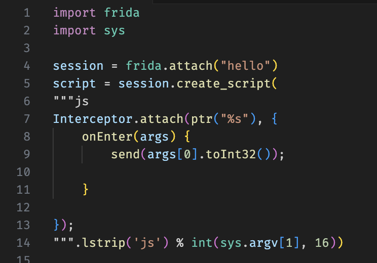

# pyjscomment README

`pyjscomment` is a Visual Studio Code extension designed to enable JavaScript syntax highlighting in Python files if the comment is multiline and begins with `js`. 

This is mostly useful when using the frida module in Python.

If you find this extension useful, consider buying me a rootbeer. I love rootbeer. 

## Features

<picture>
  <source media="(prefers-color-scheme: dark)" srcset="./imgs/a.png">
  <source media="(prefers-color-scheme: light)" srcset="./imgs/b.png">
  
</picture>

## Known Issues

For any known issues and their possible solutions, please refer to the [Issues](https://github.com/rand-tech/pyjscomment/issues) section of the project repository.

